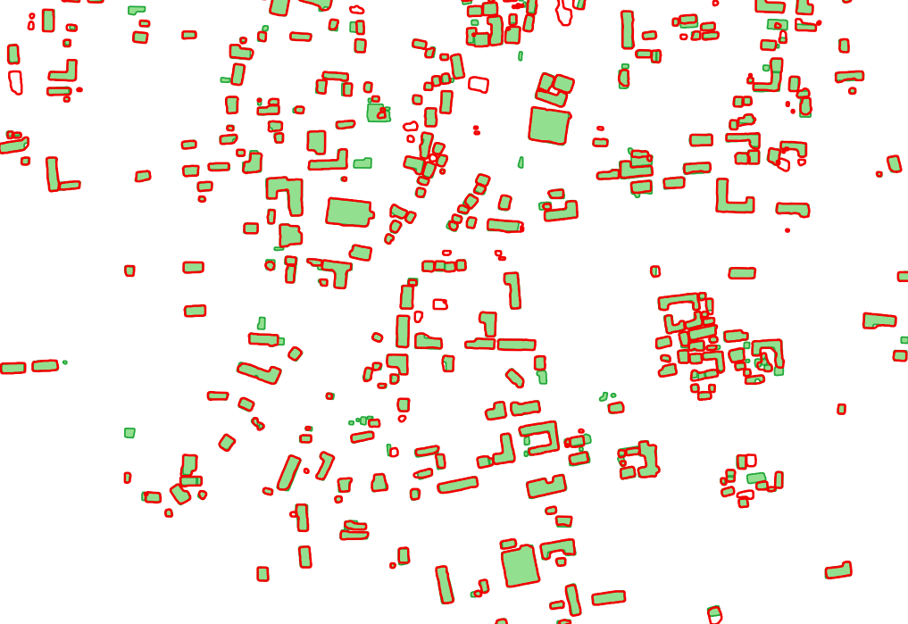

# [Replicable AI for Microplanning (ramp)](https://rampml.global/) 

Our team aspires to turn over control of the data value chain to humanitarians. The Replicable AI for Microplanning (ramp) project is producing an open-source deep learning model to accurately digitize buildings in low-and-middle-income countries using satellite imagery as well as enable in-country users to build their own deep learning models for their regions of interest.

This codebase provides python-based machine learning and data processing  tools, based on Tensorflow and the Python geospatial tool set, for using deep learning to predict building models from high-resolution satellite imagery.

The [ramp online documentation website](https://rampml.global/project-introduction/) contains complete documentation of our mission, the ramp project, the codebase, and the associated (very large) open source dataset of image chips and label geojson files.

The following screenshots several display examples of predicted building polygons, together with truth polygons, that have been produced by the ramp project group using this codebase (red polygons are predictions, green polygons are training labels provided by human labelers). 

### St Vincent AOI


### Myanmar AOI


### Ghana AOI


And ramp is just getting started.

---

## About the codebase

Things you may want to do with this codebase include:

1. Running the scripts, including production scripts and data preparation tools. 
2. Working with the Jupyter notebooks.
3. Working with the extensive ramp open source labeled dataset.
4. Training the models with your own data. 
5. Modifying the underlying code for your own purposes.

The ramp codebase uses many Python libraries that are in standard use, some specialized libraries for image and geospatial processing, and the Tensorflow library for training and running deep neural networks. It can be very difficult to create a computational environment in which all these libraries are installed and play nicely with each other. 

For this reason, we are also providing instructions to build a Docker image (based on a gpu-enabled Tensorflow 2.8 docker image with Jupyter notebook) that includes all of ramp's libraries and dependencies. All four of the above tasks can be performed from a docker container based on this image. 

For the last 3 tasks, we recommend using vscode, Microsoft's open-source code editor. This code editor easily attaches to the running ramp docker container, and can run Jupyter notebooks, including the ones used to train the ramp models. 

---

## Project structure

Note that the ramp project currently contains a fork of the [Solaris project](https://github.com/CosmiQ/solaris), which has not been under active development. Some bugfixes and modifications are in this fork, and some more extensive modifications of Solaris code have been moved into the ramp library.

```
ramp-staging
├── colab
│   └── README.md
│   └── jupyter_lab_on_colab.ipynb
│   └── train_ramp_model_on_colab.ipynb
├── data
├── docker
│   └── pipped-requirements.txt
├── Dockerfile
├── Dockerfile.dev
├── docs
│   ├── How_I_set_up_my_training_data.md
│   ├── how_to_debug_ramp_in_vscode.md
│   ├── How_to_run_production_and_evaluation.md
│   ├── list-of-ramp-scripts.md
│   └── using_the_ramp_training_configuration_file.md
|   └── images
├── experiments
│   ├── dhaka_nw
│   ├── ghana
│   ├── gimmosss
│   ├── himmosss 
├── notebooks
│   ├── augmentation_demo.ipynb
│   ├── Data_generator_demo.ipynb
│   ├── Duplicate_image_check.ipynb
│   ├── Independent_labelers_comparison_test.ipynb
│   ├── Train_ramp_model.ipynb
│   ├── Truncated_signed_distance_transform_example.ipynb
│   └── View_predictions.ipynb
│   ├── images
│   ├── sample-data
├── ramp
│   ├── __init__.py
│   ├── data_mgmt
│   │   ├── chip_label_pairs.py
│   │   ├── clr_callback.py
│   │   ├── data_generator.py
│   │   ├── display_data.py
│   │   ├── __init__.py
│   ├── models
│   │   ├── effunet_1.py
│   │   ├── __init__.py
│   │   ├── model_1_chollet_unet.py
│   ├── training
│   │   ├── augmentation_constructors.py
│   │   ├── callback_constructors.py
│   │   ├── __init__.py
│   │   ├── loss_constructors.py
│   │   ├── metric_constructors.py
│   │   ├── model_constructors.py
│   │   ├── optimizer_constructors.py
│   └── utils
│       ├── chip_utils.py
│       ├── eval_utils.py
│       ├── file_utils.py
│       ├── geo_utils.py
│       ├── imgproc_utils.py
│       ├── img_utils.py
│       ├── __init__.py
│       ├── label_utils.py
│       ├── log_fields.py
│       ├── lrfinder.py
│       ├── mask_to_vec_utils.py
│       ├── misc_ramp_utils.py
│       ├── model_utils.py
│       ├── multimask_utils.py
│       ├── ramp_exceptions.py
│       └── sdt_mask_utils.py
├── README.md
├── scripts
│   ├── add_area_to_labels.py
│   ├── binary_masks_from_polygons.py
│   ├── calculate_accuracy_iou.py
│   ├── find_learningrate.py
│   ├── get_chip_statistics.py
│   ├── get_dataset_loss_statistics.py
│   ├── get_labels_from_masks.py
│   ├── get_model_predictions.py
│   ├── make_train_val_split_lists.py
│   ├── move_chips_from_csv.py
│   ├── multi_masks_from_polygons.py
│   ├── polygonize_masks.py
│   ├── polygonize_multimasks.py
│   ├── remove_slivers.py
│   ├── sdt_masks_from_polygons.py
│   ├── tile_datasets.py
│   └── train_ramp.py
├── setup.py
├── shell-scripts
│   ├── create_aggregate_trainingset.bash
│   ├── create_masks_for_datasets.bash
│   ├── create_test_split_for_datasets.bash
│   ├── create_trainval_split_for_datasets.bash
│   ├── get_iou_metrics_for_datasets.bash
│   ├── get_iou_metrics_for_models.bash
│   ├── nvidia-check.sh
│   ├── run_production_on_datasets.bash
│   ├── run_production_on_single_dataset.bash
│   ├── write_predicted_masks_for_datasets.bash
│   └── write_truth_labels_for_datasets.bash
└── solaris
```

---

## How to get the ramp environment running on Google Colab

Instructions for getting started with ramp on Colab are in the colab/README.md file in this codebase. 

Note that things will run very slowly and painfully in the free tier of Google Colab. If you will be running often on Google Colab, I recommend upgrading to Google Pro. If you will be using Google Colab as your compute platform for running large ramp training jobs, I recommend considering Google Pro Plus. 

## How to get the RAMP environment running on a local server running Ubuntu 20.04 with GPU support

### High level Overview

1. You will need to run Ubuntu 20.04 Linux on a machine with at least one CUDA-enabled NVIDIA GPU. You will absolutely need to have sudo (root user) powers on it.
2. Install the currently recommended NVIDIA driver: [instructions here](https://linuxize.com/post/how-to-nvidia-drivers-on-ubuntu-20-04/). (It could be worse: happily, you do not need to install the CUDA libraries, as you would if you weren't using Docker).
3. Install docker CE, and the NVIDIA Container Toolkit ([instructions here](https://docs.nvidia.com/datacenter/cloud-native/container-toolkit/install-guide.html#docker)).
4. Create the 'docker' group and add yourself to it, so you can run docker without using sudo ([instructions here](https://docs.docker.com/engine/install/linux-postinstall/)).
5. Using docker, build the ramp base image, rampbase, as instructed below:

```text
# run from the ramp-code directory
docker build --tag rampbase .
```

**Important note**: You will have to rebuild rampbase after any change you make in the ramp module codebase (under ramp-code/ramp) so that the change will be installed in the container. This is not the case for running scripts or notebooks.

6. Start a docker container based on rampbase, and run a bash shell in it, as follows:

```
docker run -it --rm --gpus=all -v /home/carolyn/ramp-staging:/tf/ramp-staging -v /home/carolyn/ramp-data:/tf/ramp-data  -p 8888:8888 rampbase bash
```

If you wish to run a script: do so in the bash shell, using the default python interpreter, which will be loaded with all the components of ramp. 

Note that there is a Jupyter notebook server installed in a ramp container, and the *-p 8888:8888* portion of the 'docker run' command enables port forwarding so that you can run Jupyter notebook in a browser on your host machine. 

If you wish to run a Jupyter notebook in your browser or in Jupyterlab, start your docker container using the same command without 'bash' at the end, as shown below. You will be given a link to the running Jupyter notebook server in the command output.

```
docker run -it --rm --gpus=all -v /home/carolyn/ramp-staging:/tf/ramp-staging -v /home/carolyn/ramp-data:/tf/ramp-data  -p 8888:8888 rampbase
```

If you wish to run a bash shell in the Jupyter notebook container, so that you can run scripts as well as the Jupyter notebook, you can connect a bash shell to the same container using the following commands. 

First, run:

```
docker ps
```

This will give an output listing of all the docker containers running on your machine, similar to that given by the Unix ps command:

```
CONTAINER ID   IMAGE     COMMAND   CREATED       STATUS       PORTS                                       NAMES
209755699cea   rampdev   "bash"    3 hours ago   Up 3 hours   0.0.0.0:8888->8888/tcp, :::8888->8888/tcp   condescending_cerf
```

You can use either the container id or the container name to connect to it with a bash shell, using the following command:

```
docker exec -it condescending_cerf bash
```

This will give you a bash shell in the same container that is running your jupyter notebook. 

Instructions on how to debug ramp code, and run Jupyter notebooks, in VScode on your desktop are given in [How to debug ramp in vscode](docs/how_to_debug_ramp_in_vscode.md).

---

## A note on running ramp as yourself, vs. as the root user

Note that by default, Docker runs containers as the root user. If you want to use vscode to attach to the container, you will need to run the container as the root user, because vscode needs root permission to install its server in the container. 

This means that any files you create during the Docker session will have root user ownership. This is undesirable from a security standpoint, and is a hassle when you later need to change or delete the files you created on the local machine. (Note, to fix this problem run the following Linux command: *find . -user root | xargs sudo chown your-username*.)

If you are just going to interact with the bash shell (say to run production code or a script), I recommend running the container as yourself, rather than the root user. To do that, add the *--user 1000:1000* switch as shown below. 

```text
# run from anywhere as yourself (as the non-root user)
docker run -it --rm --gpus=all --user 1000:1000 -v /home/carolyn/ramp-staging:/tf/ramp-staging -v /home/carolyn/ramp-data:/tf/ramp-data -p 8888:8888 rampbase
```


____

LICENSING:

This software has been licensed under the [Apache 2.0 software license](https://www.apache.org/licenses/LICENSE-2.0.txt).
