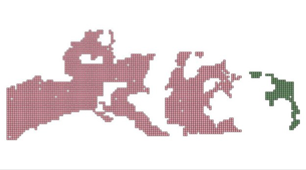

# How I set up my training data for the ramp project


## Introduction

In a project like [ramp](https://rampml.global/), in which it's critical for the learning algorithm to access training datasets in various versions and over a number of areas of interest, you need a plan for storing and processing datasets. This document describes the data management plan and layout that evolved during ramp development; my hope is that ramp will be easier for you to use if you follow it fairly closely. 

In addition, I've included BASH shell scripts for 'data wrangling' that make direct use of this data storage structure; if you maintain the data storage structure, you can also use the shell scripts with minimal changes, and save yourself a lot of data wrangling pain.

## The RAMP_HOME environment variable

I run the ramp code in two different environments: in the ramp Docker container, and natively on my host Linux server. In addition, I sometimes run the QGIS tools for data visualization on my Windows PC. 

In each of these environments, an environment variable called RAMP_HOME needs to be defined. RAMP_HOME is the parent directory for all of your data and code directories in any environment where ramp is run. For example, in the ramp Docker container, RAMP_HOME is defined to be '/tf' because this is the root directory for the Tensorflow Docker container that the ramp Docker container derives from.

On my host Linux server, RAMP_HOME is defined to be '/home/carolyn'. 

All of my data for the ramp project is stored in a subdirectory of RAMP_HOME named 'ramp-data', so that on my host Linux server, it's all in /home/carolyn/ramp-data. 

The ramp codebase is stored in a subdirectory of RAMP_HOME named 'ramp-code'.

## The top-level ramp data storage structure

The ramp training data consists of a multitude of datasets sourced over different areas of interest (AOIs). These include AOIs over Ghana, Haiti, Myanmar, Bangladesh, and many other locations. Each dataset consists of RGB Geotiff training images, 256x256 pixels, with matching labels in the form of vector polygons in GeoJSON format. All of the Geotiff and GeoJSON data is georeferenced, mostly in the WGS84 long/lat georeferencing system. Matching image and label files have the same unique filenames, except for the 'geojson' and 'tif' suffixes; all of the ramp code is based on this assumption.

In the ramp-data directory, I create the following subdirectories:

```
-ramp-data
	--PREP
	--TRAIN
	--TEST
```

Each of these directories has subdirectories that are devoted to specific datasets. For example, my TRAIN directory looks like this:

```
-ramp-data
	-TRAIN
		-ghana
		-haiti
		-india
		-malawi
		-...
```

All that matters is that each dataset directory is uniquely named: for example, if I had two different Ghana AOIs, I might name them ghana and ghana2.

The same directories exist under the TEST directory:

```
-ramp-data
	-TEST
		-ghana
		-haiti
		-india
		-malawi
		-...
```

All of the data that the model needs to access during training is stored in subdirectories under each of these AOI directories.

### The structure of a directory in ramp-data/TRAIN

Each AOI directory under TRAIN contains several subdirectories that are accessed during model training, and are consistently named. For example, in the TRAIN/ghana directory, we would have:

```
-ramp-data
	-TRAIN
		-ghana
			-chips
			-labels
			-multimasks
			-valchips
			-val-labels
			-val-multimasks

```

The first set of subdirectories contains data that the model uses to learn during the training process.
- *chips*: contains geotiff 256x256 image 'chips' for training.
- *labels*: contains geojson files containing all building polygons matching the training image chips. 
- *multimasks*: contains geotiff 256x256 image 'masks' matching the training chips. Pixels have the value 0 if no building is present or nearby; '1' if the pixel is in a building interior; '2' if the pixel is on a building boundary; and '3' if the pixel is close to two or more buildings. 

The second set of subdirectories contains validation data -- data that you use to check that the training process is actually improving the model. This validation data is selected via a random sample from the initial training dataset; usually about 10-15% of the AOI dataset will become validation data.
- *valchips*: contains geotiff 256x256 image 'chips' used for validation during training.
- *val-labels*: contains geojson files containing all building polygons matching the validation image chips. 
- *val-multimasks*: contains geotiff 256x256 image 'multichannel masks' matching the validation chips. 

The same image chips cannot be in both the training and validation sets. The ramp codebase contains programs to split training and validation sets apart.

### The structure of a directory in ramp-data/TEST

Each AOI directory under TEST contains data that is used only after training is complete, to test how well the model generalizes to data it has not seen yet.  It is set aside for this purpose, before any training occurs. 

Why don't we look at test data during training? Because any dataset used to check results during training, including the validation data contained in the ramp-data/TRAIN directory, effectively becomes part of the training process. We want the TEST dataset to provide an unbiased estimate of how well our trained model is likely to generalize to new, unseen data... and so the TEST data has to be *really unseen* until the moment it's used for testing the final model. 

The TEST directory has the contents shown below. No validation datasets are necessary in the test dataset. In general, about 10% of the content of each AOI is set aside for TEST, and the remaining 90% is split between training and validation data. 

```
-ramp-data
	-TEST
		-ghana
			-chips
			-labels
			-multimasks
```

The process of test data selection is a little different from that of validation data. Validation data is selected at random from among the data that will become the training data; but test data is generally chosen from a separate section of the full AOI. 

The image below shows the test set in the Oman AOI in green. The validation data is sampled at random from the majority dataset, in pink.



## Setting up training data for a new AOI from the ramp-data/PREP directory

When I first receive a new pair of directories containing 256x256 geotiff chips and their matching label files to process into training data, I place them into a subdirectory of ramp-data/PREP as follows:

```
-ramp-data
	-PREP
		-ghana
			-chips
			-labels
```

I will need to go through multiple steps in order to produce binary and/or multichannel masks, and distribute them to their final locations in the ramp-data structure. 

### Step 1: create multichannel masks

Before I move any files, I create multichannel masks for all the files using *ramp-code/scripts/multi_masks_from_polygons.py*.  This is a python script, and it is called from the RAMP_HOME directory as follows:
```
python ramp-code/scripts/multi_masks_from_polygons.py -in_vecs ramp-data/PREP/ghana/labels -in_chips ramp-data/PREP/ghana/chips -out ramp-data/PREP/ghana/multimasks
```

These can be created for a large number of different AOIs all at once, using an edited version of the bash script *ramp-code/shell-scripts/create_masks_for_datasets.bash*.

### Step 2: separate the test data set from the rest of the data in the PREP directory, and move it to TEST.

##### 2.1: select your test set
This is the most manual part of the process. Here's how I do it, using QGIS.

To start with, I will need a map overview of my entire training set, which I can get using the *ramp-code/scripts/get_chip_statistics.py* script. From the RAMP_HOME directory, I call:

```
python ramp-code/scripts/get_chip_statistics.py -idir ramp-data/PREP/ghana/chips -ldir ramp-data/PREP/ghana/labels -csv ramp-data/PREP/ghana_chipstats.csv
```

This script produces a csv (and a colocated geojson file) containing statistics about each chip/label pair in the PREP/ghana dataset. The geojson file can then be loaded into QGIS to give you a spatial view of all your chips, as in the Oman image above. 

Working in QGIS, using the group selection tool, I select an area of the AOI that is a bit separated from the rest of the data, or at least on the edge of it. I then export the selected data to a new geojson file in the PREP/ghana directory, *ghana_test_chips.geojson* (to export, right click on the ghana_chipstats menu item and select *export*). I keep this file in case I need a map of the chips I set aside for testing.

Still in QGIS, I will then export the contents of the *ghana_test_chips.geojson* file to a new format: a CSV file containing only the names of the image chips I've selected to be in my test set (QGIS does support exporting to CSV; select only the image chip field to be exported in the export window).  This CSV file, named *ghana_test_chips.csv*, will be used to move the test chips, labels, and binary and/or multimasks to the ramp-data/TEST directory. 

##### 2.2: move your test set to ramp-data/TEST.

The *ramp-code/scripts* directory contains a python script, *move_chips_from_csv.py*, that can be used to move or copy all the ramp data filenames in a CSV from one location to another. 

However, it is more flexible than an ordinary move command. For example, if I pass a list of chip Geotiff files to *move_chips_from_csv.py*, and tell it to move files in a directory of GeoJSON *label* files, it will move the label files that match the chips in the list. The same is true if you point it at a directory full of binary or multichannel masks, and give it a list of chip or even label names. 

This works because the names of matching chip, label, and mask files all have the same bases: e.g., *ae440685-4893.tif, ae440685-4893.json,* and *ae440685-4893.mask.tif* all are recognized by ramp code as matching files.

To move the entire test dataset over to the test directory, you will call *move_chips_from_csv.py* from the RAMP_HOME directory several times, as follows:

```
python ramp-code/scripts/move_chips_from_csv.py -sd ramp-data/PREP/ghana/chips -td ramp-data/TEST/ghana/chips -csv ramp-data/PREP/ghana/ghana_test_chips.csv -mv

python ramp-code/scripts/move_chips_from_csv.py -sd ramp-data/PREP/ghana/labels -td ramp-data/TEST/ghana/labels -csv ramp-data/PREP/ghana/ghana_test_chips.csv -mv

python ramp-code/scripts/move_chips_from_csv.py -sd ramp-data/PREP/ghana/multimasks -td ramp-data/TEST/ghana/multimasks -csv ramp-data/PREP/ghana/ghana_test_chips.csv -mv

```

The *-sd* and *-td* flags stand for *source* and *target* directory. The *-mv* flags cause the test files to be moved out of the source directory, not just copied: thus, after this step is complete, only training and validation data will be left in the ramp-data/PREP directory. 

This step can be automated for many AOIs at once using the shell script *create_test_split_for_datasets.bash*. In order to use this shell script, the csv with the file list must be named *test_chips.csv*. If your test file csv is named something else (such as *ghana_test_chips.csv*), then create a softlink to solve this problem:

```
# ln -s src_file dest_file
ln -s ghana_test_chips.csv test_chips.csv
```

### Step 3: Split the remaining data into training and validation data sets, and move them to the ramp-data/TRAIN directory.

The ramp codebase contains a python script, *ramp-code/scripts/make-train-val-split-lists.py*, that can be used to separate the full dataset into randomized lists of chip files: one for training, one for validation. To run this script, you would call the script like this from the RAMP_HOME/ramp-data/PREP/ghana directory:

```
python $RAMP_HOME/ramp-code/scripts/make_train_val_split_lists.py -src $RAMP_HOME/ramp-data/PREP/ghana/chips -pfx ghana_split -trn 0.85 -val 0.15
```

This will produce two files in the current directory (RAMP_HOME/ramp-data/PREP/ghana), which will contain lists of randomly selected chips to use for training and validation. These files will be named 'ghana_split_train.csv' and 'ghana_split_val.csv'; the former will contain 85% of the chips, and the latter will contain 15%. 

To move the TRAINING chips to the appropriate locations, call from RAMP_HOME:

```

# move all the TRAINING chips to their new locations

python ramp-code/scripts/move_chips_from_csv.py -sd ramp-data/PREP/ghana/chips -td ramp-data/TRAIN/ghana/chips -csv ramp-data/PREP/ghana/ghana_split_train.csv -mv

python ramp-code/scripts/move_chips_from_csv.py -sd ramp-data/PREP/ghana/labels -td ramp-data/TRAIN/ghana/labels -csv ramp-data/PREP/ghana/ghana_split_train.csv -mv

python ramp-code/scripts/move_chips_from_csv.py -sd ramp-data/PREP/ghana/multimasks -td ramp-data/TRAIN/ghana/multimasks -csv ramp-data/PREP/ghana/ghana_split_train.csv -mv
```

and to move the VALIDATION chips to the appropriate locations, call from RAMP_HOME:

```

# move all the VALIDATION chips to their new locations

python ramp-code/scripts/move_chips_from_csv.py -sd ramp-data/PREP/ghana/chips -td ramp-data/TRAIN/ghana/valchips -csv ramp-data/PREP/ghana/ghana_split_val.csv -mv

python ramp-code/scripts/move_chips_from_csv.py -sd ramp-data/PREP/ghana/labels -td ramp-data/TRAIN/ghana/val-labels -csv ramp-data/PREP/ghana/ghana_split_val.csv -mv

python ramp-code/scripts/move_chips_from_csv.py -sd ramp-data/PREP/ghana/multimasks -td ramp-data/TRAIN/val-multimasks -csv ramp-data/PREP/ghana/ghana_split_val.csv -mv
```

After this final step, the PREP/ghana/chips, PREP/ghana/labels, and PREP/ghana/multimasks directories should be empty!

Your data is all in the correct places for training now.

This step can be automated for many AOIs at once using the shell script *create_train_val_split_for_datasets.bash*.

## Creating new training datasets by combining existing ones

Finally, you may want to create very large training datasets by combining a lot of smaller AOIs into a single training dataset! But if you were to copy all the files from each AOI to a new location, you would soon find yourself running low on disk space for data. 

On Linux, you can solve this problem by creating new training set directories that contain *soft links* to data files in other directories. These soft links are like 'shortcuts' in Windows; they basically just point back to the original files, and take up much less disk space than a copy of the original file would. When you are done with them, you can just erase them, and no harm is done to the original file. 

On Linux, a soft link is created to an existing file in the new location by first navigating to the new location, and then creating the soft link, as follows:

```
cd /path/to/new/location

ln -s /path/to/existing/file.tif .
```

You can soft link all the files in a directory by typing:

```
ln -s /path/to/existing/dir/* .
```

This step can be automated for many AOIs at once using the shell script *create_aggregate_trainingset.bash*. It will create aggregated training, validation, and test sets, using soft links, in the right positions in a new  training dataset.

For example, if you want a new aggregate dataset named *all_of_africa*, this script could be used to create directories named *ramp-data/TRAIN/all_of_africa* and *ramp-data/TEST/all-of-africa* by setting the variables at the top of the script as follows:

```
export AGG_DATASET_NAME=all_of_africa
export DATASET_NAMES=(nigeria drc kenya ghana sudan chad cameroon)
```