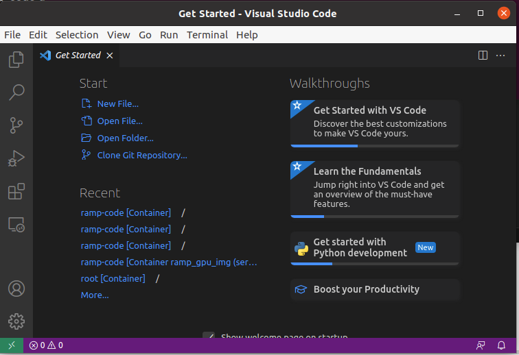

# Setting up a debug environment in a docker container using VisualStudio code

VisualStudio Code is an amazing tool. It supports containerized development in so many different ways, and the documents can be confusing. These are instructions for setting up a working containerized dev environment, by attaching VSCode to a running container.

 At a high level, here's how it works.
 
Step 1: Build a docker image based on the Dockerfile.dev file, instead of the Dockerfile, as follows:

 ```
 docker build --tag rampdev -f Dockerfile.dev .
 ```
 
Step 2: Start a docker container with a bash shell into it, as follows:

```
docker run -it --rm --gpus=all -v /home/carolyn/ramp-code:/tf/ramp-code -v /home/carolyn/ramp-code:/tf/ramp-code  -p 8888:8888 rampdev bash
```

You should replace */home/carolyn* with your RAMP_HOME path on your own host machine. Note that */home/carolyn* is the RAMP_HOME directory on my server, and */tf* is RAMP_HOME in the container.

This will open a bash shell in the rampdev container, in the */tf* directory. 

**WARNING**: Note that this container will run as root using the previous command; this is necessary in order for VSCode to install a server in it, so that you can debug. This means that new source files that you create in VSCode, in your mounted volumes, will have root user permissions. This can be fixed with 'sudo chown <your_user> <filename>' on the host system. I don't currently have a better solution for this problem. 

Note that */tf* contains two subdirectories: *ramp-code*, which contains your codebase, and *ramp-data*, which contains all the data accessed by your ramp project. 

Now you'll dynamically install the ramp modules from *ramp-code*, as follows:

```
cd ramp-code
pip install -e .
```

This will give you a development-ready installation of the ramp modules in your container, from the code you've mounted into the container.

You'll then attach to the same container with VisualStudio Code, using its Remote-Containers extension (you'll need to be running the container as root in order for VSCode to install itself into the container). Any changes you make to the code base in the process of debugging will be picked up by the debugger.

#### Step-by-step instructions for attaching to the rampdev container with VSCode

1. Start Visual Studio code (assuming it is already installed on your machine: [here is the link for installation on Ubuntu](https://code.visualstudio.com/docs/setup/linux)). 

2. In VSCode, Open Settings > Extensions ('Settings' is the little gear icon on the extreme left panel, at the bottom); select, install, and enable the Remote - Containers extension. The little green icon will appear on the VS Code window at the lower left, as seen below. 



3. Click on the little green icon, and a menu of Remote-Containers commands will come up. Select 'Attach to Running Container', and select the rampdev container you started (there is usually only one running at a time anyway).

4. The green icon at the lower left will now show that you're attached to the container you selected. Go to the VSCode File Explorer at the top of the panel on the left, and open the '/ramp-code' directory. You are ready to debug!

