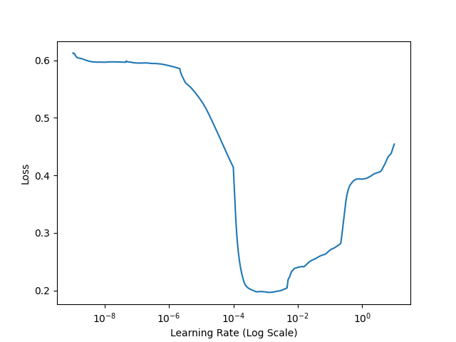

# List of ramp scripts and their functions

These are python scripts in the directory ramp_staging/scripts. They are listed in alphabetical order.

## add_area_to_labels.py

Given an input label file containing building labels, this script will create a new file of building labels with an added 'area' attribute. Area is calculated in square meters.

Example: add_area_to_labels.py -lfn lfilename.geojson -out lfilename_plus_area.geojson  

## binary_masks_from_polygons.py

Given directories of image (\*tif) and label (\*geojson) files with matching basenames, this script will create a third directory containing binary building masks that match the georeferencing of the image file. Building = 1, Background = 0.

Example: binary_masks_from_polygons -in_vecs vector_dir -in_chips chip_dir -out binary_mask_dir

Matching basenames example: 0022a2a0-fedb-48a5-8de9-274d64596401.tif, 0022a2a0-fedb-48a5-8de9-274d64596401.geojson.

## calculate_accuracy_iou.py

Given a validation dataset, i.e., a directory consisting of truth label files (\*geojson) and another consisting of test label files with matching basenames (see examples below), this script will calculate individual and aggregate F1, precision, and recall of the building detections.

It will also work for single geojson truth and predicted building files, such as are output during the production process.

Truth and test building matches are determined based on the maximum IoU (intersection-over-union) value for a candidate truth and test building pair. A match is accepted if the IoU of the truth and test building pair is over a threshold value; by default this threshold value is 0.5. This metric is used as the standard Spacenet Challenge metric for building detection algorithms. 

Example for individual geojson files: 
    
    calculate_accuracy_iou.py -truth truth_labels_filename.json -test predicted_labels_filename.json \\
        -log logfilename.csv -note note_for_log -mid modelname_for_log -dset datasetname_for_log

Example for directories of matching truth and detected geojson labels:

    calculate_accuracy_iou.py -truth truth_labels_dir -test predicted_labels_dir \\
        -log logfilename.csv -note note_for_log -mid modelname_for_log -dset datasetname_for_log
    

Examples of files with matching basenames: 0022a2a0-fedb-48a5-8de9-274d64596401.geojson and 0022a2a0-fedb-48a5-8de9-274d64596401.geojson (same name); 0022a2a0-fedb-48a5-8de9-274d64596401.geojson and 0022a2a0-fedb-48a5-8de9-274d64596401.pred.geojson;
0022a2a0-fedb-48a5-8de9-274d64596401.geojson and 0022a2a0-fedb-48a5-8de9-274d64596401.mask.geojson.

## find_learningrate.py

This script can be used, prior to a full training run, to determine an optimal range or value for the learning rate hyperparameter of the training run. The learning rate hyperparameter determines the size of the step that the learning algorithm will take each time a training batch is processed: if it's too high, the learning algorithm will never find a good solution; if it's too low, the learning algorithm will learn too slowly. 

This script produces a plot that shows the rate at which the training loss drops as the learning rate is adjusted. The training loss is dropping fastest when the learning rate is in the range 10E-05 - 10E-04, so the user should select an initial learning rate within that range. 

This script takes one parameter, the name of a 'ratefinder' configuration file. A ratefinder configuration json file is similar to a training configuration json file, in that it specifies choices for a training run; but it contains another group of parameters, the 'lrfinder' group, that specifies the parameters to use for finding an optimal learning rate. A sample ratefinder configuration file is in the ramp codebase at experiments/SPO-data/20220627_baseline_augmentation_ratefinder.json.

Example: find_learningrate.py -config ratefinder_config_file.json 

## get_chip_statistics.py

Given a training dataset consisting of directories containing image and geojson building label files with matching basenames, this script calculates statistics for individual chips; e.g., how many buildings it contains, and whether any buildings are defined over nodata areas. It produces an output csv containing the statistics, and a geojson file containing the polygon outlines of chips along with their statistics.

Example: get_chip_statistics.py -idir chips -ldir labels -csv chip_statistics.csv

## get_model_predictions.py

Given a trained model and a directory containing geotiff image chips, this script produces predictions from the model, in the form of geotiff masks, and writes the masks (with matching basenames) to a new mask directory. 

Example: get_model_predictions.py -mod model_dir -idir chips -odir predicted_masks. 

Essentially, this script is the critical 'production' script.

## get_dataset_loss_statistics.py

Given a training dataset consisting of directories containing image and geojson building label files with matching basenames, and a trained model, this script calculates loss function and accuracy metric values for individual training chip pairs. 

This script is used to diagnose quality problems with training chip pairs; very high loss values may indicate serious quality problems with certain pairs. 

Example: get_dataset_loss_statistics.py -m model_directory -idir chips -mdir multimasks -csv loss_values.csv    

## make_train_test_split_lists.py

Given a complete dataset of two directories containing image and geojson building label files with matching basenames, this script produces csv files containing lists of filenames to be moved into training, validation, and/or test directories. Using these lists, the files can be moved using the script 'move_chips_from_csv.py'. 

Example: make_train_val_split_lists.py -src chips -trn 0.85 -val 0.15

## move_chips_from_csv.py

Given a text file containing a list of geotiff or geojson label files, a 'source' directory of geotiffs or geojsons, and a 'target' directory, this script moves or copies files with matching basenames from the source directory to the target directory. 

Since the script looks for matching basenames, and not perfectly matching filenames, a text file containing a list of geotiff files can be used to move geojson files as long as the basenames match. 

Examples: To move files: 

move_chips_from_csv.py -sd multimasks -td val-multimasks -csv datasplit_val.csv -mv

To copy files leave off the -mv flag:

move_chips_from_csv.py -sd multimasks -td val-multimasks -csv datasplit_val.csv

## multi_masks_from_polygons.py

Given directories of image (\*tif) and label (\*geojson) files with matching basenames, this script will create a third directory containing multichannel building masks that match the georeferencing of the image file. Background = 0, Building = 1, Building boundary=2, Close contact points=3. 

Example: multi_masks_from_polygons.py -in_vecs labels_dir -in_chips chips_dir -out multimask_dir -bwidth 2 -csp 4

See the help documentation in the script for more details. 

Matching basenames example: 0022a2a0-fedb-48a5-8de9-274d64596401.tif, 0022a2a0-fedb-48a5-8de9-274d64596401.geojson.

## polygonize_masks.py

Given a directory containing binary building masks (usually the output of prediction from a model, such as is produced by get_model_predictions.py), this script produces a directory containing geojson files with matching basenames that are derived from the binary building masks, as follows:

Example for polygonizing binary masks: polygonize_masks.py -in binary_masks_dir -out polygons_dir

The same script can be used to polygonize Signed Distance Transform masks:

Example for polygonizing SDT masks: polygonize_masks.py -in SDT_masks_dir -out polygons_dir -sdt -t 3

## polygonize_multimasks.py

Given a directory containing multichannel building masks (usually the output of prediction from a model, such as is produced by get_model_predictions.py), this script produces a directory containing geojson files with matching basenames that are derived from the multichannel building masks. Multichannel building masks are first converted to binary masks by collapsing boundary pixels to building pixels, and close contact points to background pixels, before polygonizing the result. 

Example: polygonize_multimasks.py -in multimask_dir -out polygons_dir.

## remove_slivers.py

Given a directory containing geojson files of building labels (either truth data, or prediction data resulting from polygonize_masks.py or polygonize_multimasks.py), this script will remove buildings from each geojson file that are below a provided threshold in area, defined in square meters.

Example: remove_slivers.py -ldir input_labels_dir -fdir output_labels_dir -min 10.0

## sdt_masks_from_polygons.py

Signed distance transform masks are another type of mask that was explored by the ramp project. Although they were not used in the final project, the code for producing signed distance transform masks will be useful. This code is derived from the [Solaris]() code distribution, but fixes a problem in the original code where buildings that touch were treated as a single building. 

Given a training dataset of directories containing geotiff image chips and matching geojson building labels, this script produces a directory of Truncated Signed Distance Transform masks with matching basenames, and georeferencing matching the input image chips.

Example: sdt_masks_from_polygons.py -in_vecs labels_dir -in_chips matching_chips_dir -out output_sdt_masks_dir
    -mpp meters_per_pixel_in_input_chips -usb 3 -lsb 3 

See the help documentation in the script for more details. 

## tile_datasets.py

Typically, building polygon labeling is done on a large image mosaic or strip, in order to take advantage of its broader context. After labeling is finished, the mosaic and label set have to be split into smaller chips for model training. 

Tile_datasets.py tiles the mosaic and label set into image chips of a user-specified size, and smaller label sets matching the chips. It also optionally creates a geojson data set containing the tile boundaries for each chip file, i.e., a 'registry' of the chips created. 

A threshold can be set so that image chips containing too many invalid pixels are not included in the output.  

Example: tile_datasets.py -img large_AOI_image.tif -vecs large_AOI_vectors.geojson -out output_dir -pfx large_AOI -trec directory_of_tiles.geojson -ndt 0.4 -oht 256 -owd 256

See the help documentation in the script for more details.

## train_ramp.py

This script performs training runs using a configuration defined in a ramp training configuration file. Samples of such files can be found in the 'experiments' directory in the ramp codebase. Detailed descriptions of the configuration files, and training process, are found in *docs/using_the_ramp_training_configuration_files.md*. 

Example: train_ramp.py -config train_config.json

